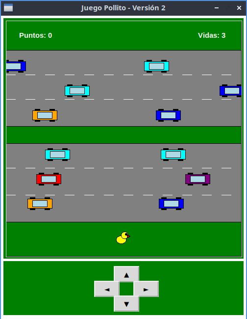

# juego del pollito

Es un juego estilo Frogger hecho en Python con la librería gráfica Tkinter. El jugador controla a un pollito que debe esquivar el tráfico de una carretera para llegar al otro lado.

MECÁNICAS Y REGLAS

- Objetivo: Cruzar la calle desde la parte inferior hasta la zona verde superior.

- Puntuación: Cada llegada exitosa suma 100 puntos y regresa al personaje al inicio.

- Vidas: Inicias con 3 vidas. Chocar con un carro te resta 1 vida y reinicia tu posición. Al perder las 3 vidas, el puntaje vuelve a 0.

- Tráfico: Los carros circulan en 6 carriles horizontales con direcciones y velocidades alternadas. Al salir de la pantalla, reaparecen por el otro lado.

# COMPONENTES DEL CÓDIGO

- crear_carros(): Genera los vehículos con carriles, velocidades, direcciones y colores aleatorios.

- mover_arriba/abajo/izquierda/derecha(): Controlan el movimiento del personaje (de 20 en 20 píxeles) e impiden que se salga de la pantalla.

- mover_carros_y_colisiones(): Bucle principal que anima los carros cada 30 ms y detecta choques entre el pollito y los vehículos.

- dibujar(): Redibuja el mapa (carretera, césped), los carros, el personaje y la puntuación en pantalla.

Controles: Funciona tanto con las flechas del teclado como con un panel de botones en la parte inferior.